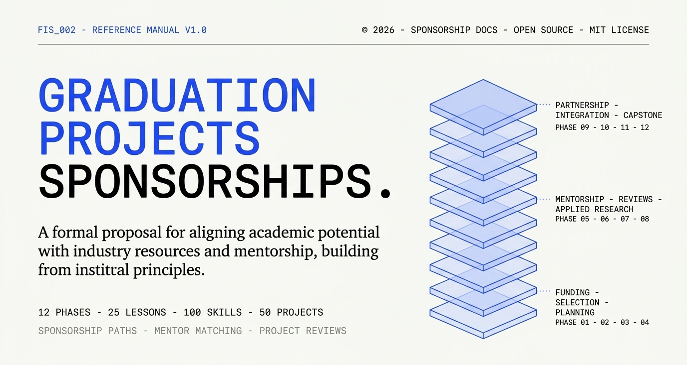

# 🎓 Egypt Graduation Projects & Sponsorship Guide (2026/2027)

[-success.svg)](#)

A smart, curated directory of graduation project grants, corporate sponsorships, incubators, prototyping labs, and national competitions across Egypt — **sorted by practical value, funding size, and popularity among Egyptian university students.**

---

## 🚨 Urgent Deadlines

| Opportunity | Deadline | Urgency | Action |
|:---|:---:|:---:|:---|
| **ASRT Mashroey Bedayti (Consortium Track)** | **Sep 30, 2026** | 🚨 **4 Days Left** | [Submit Consortium Form](http://eforms.asrt.sci.eg/GraduationProjectOrg) |
| **Graduation Project Competition 4.0 (Desco)** | **Sep 30, 2026** | 🚨 **4 Days Left** | [Submit Portfolio](https://wearedesco.com/competition/egyptian-graduation-project-competition-3-0/) |
| **Founder Institute Cairo (Fall 2026)** | **Oct 6, 2026** | ⚠️ **~10 Days Left** | [Apply to Cohort](https://fi.co/join) |
| **ASRT Mashroey Bedayti (Individual Track)** | **Oct 31, 2026** | ⏳ **Open (~1 Month)** | [Submit Individual Form](http://eforms.asrt.sci.eg/GraduationProject) |
| **Huawei ICT Competition 2026–2027** | **Oct / Nov 2026** | ⏳ **Active** | [Register Academy](https://www.huawei.com/minisite/ict-competition) |

---

## 📊 Master Directory (Ranked by Priority for Egyptian Students)

| # | Opportunity | Provider | Track | Support / Value | Eligibility | Deadline | Link |
|:---:|:---|:---|:---:|:---|:---|:---:|:---:|
| **01** | **Mashroey Bedayti (مشروعي بدايتي)** | ASRT | Grant | **Up to 100K EGP** (Team) / 20K EGP (Indiv.) | Final-year students (All Egyptian universities) | **Sep 30** (Consortium) / **Oct 31** (Indiv.) | [Apply](http://eforms.asrt.sci.eg/GraduationProjectOrg) |
| **02** | **CREATIVA Hubs (مراكز إبداع مصر الرقمية)** | MCIT / TIEC | Incubation | **Up to 360K EGP** (Zero Equity) + Free Hubs | Senior projects & student tech ventures | **Year-Round** (Jan/Jul cycles) | [Visit](https://creativa.gov.eg/about-creativa/) |
| **03** | **Egypt IoT & AI Challenge** | ASRT + IEEE + ITIDA | Contest | Prototyping + Mentorship + Arab Finals Trip | Senior teams (up to 10 members) | **Open Now** | [Register](https://register.arabiotai.org/) |
| **04** | **DEBI (مبادرة بُناة مصر الرقمية)** | MCIT | Master's | **100% Free Master's** + Monthly Stipend + Certs | ICT/Eng grads (past 5 years, Very Good+) | **Open Now** | [Apply](https://debi.gov.eg) |
| **05** | **Start IT Incubation** | TIEC / ITIDA | Incubation | **Up to 480K EGP** in-kind + **$10K AWS** + Office | Working prototype + business plan | **Year-Round** | [Apply](https://tiec.gov.eg/English/Programs/Start-IT/Pages/default.aspx) |
| **06** | **Vodafone R&D Graduation Support** | Vodafone Egypt | Grant | **Direct funding** + Labs + Senior mentorship | Egyptian university students (Telecom/CS) | **Rolling** | [Email](mailto:Vodafone.RnD@vodafone.com) |
| **07** | **Dell Envision the Future** | Dell Technologies | Contest | **$12,000 USD** Cash Prizes + Fast-track hiring | Senior Engineering / CS (MEA Region) | **Open Now** | [Apply](https://www.dell.com) |
| **08** | **Huawei ICT Competition** | Huawei Egypt | Contest | Global Finals trip + Prizes + Free Certs | Enrolled in university ICT Academies | **Oct / Nov 2026** | [Register](https://www.huawei.com/minisite/ict-competition) |
| **09** | **Egypt Semiconductor Challenge** | EITESAL | Industry | IC/Chip design training + Mentor access | Electronics & microelectronics seniors | **Open Now** | [Apply](https://www.eitesal.org/en/innovation-progression/projects/current-projects) |
| **10** | **Orange FabLab & Data Support** | Orange Egypt | Lab / Data | Telecom datasets + Free FabLab prototyping | Projects using Orange/telecom cases | **Rolling** | [Request](https://www.orange.eg/en/about/company-overview/social-responsibility/youth-foundation/graduation-projects-data-support) |
| **11** | **MINT Incubator (Cycle 15)** | EG Bank + Cairo Angels | Accelerator | 3-Month equity-free accelerator + Investors | Youth founders (18–35) with MVP | **Cycle 15 Open** | [Apply](https://mint.eg-bank.com) |
| **12** | **EITESAL Incubator & IDEA** | EITESAL + Drosos | Incubation | Seed support + AI & entrepreneurship training | Seniors & grads (Cairo, Alex, Delta, Upper Egypt) | **Open Now** | [Apply](https://www.eitesal.org/en/innovation-progression/projects/current-projects) |
| **13** | **Egypt Scholars (علماء مصر)** | Egypt Scholars Inc. | Mentorship | Free 1-on-1 expert research mentorship | Senior teams nominated by supervisor | **Rolling** | [Apply](https://egyptscholars.org/mentoring-center/support-service/support-service-gp/) |
| **14** | **MSMEDA University Protocols** | MSMEDA | Campus | Feasibility training + Low-interest loan lines | Seniors at ~25 partner universities | **Ongoing** | Campus TICO/UCCC |
| **15** | **Founder Institute Cairo** | Founder Institute | Accelerator | Pre-seed curriculum + Global investor network | Student & early-stage startup teams | **Oct 6, 2026** | [Apply](https://fi.co/join) |
| **16** | **Graduation Project Competition 4.0** | wearedesco / Bustler | Architecture | Regional exhibition + Architecture hiring | Architecture, Interior & Urban Planning | **Sep 30, 2026** | [Submit](https://wearedesco.com/competition/egyptian-graduation-project-competition-3-0/) |
| **17** | **Cisco Networking Academy** | Cisco + NTI | Training | Free vouchers + Lab simulations + Certs | University students & fresh grads | **Ongoing** | [Portal](https://www.netacad.com) |

---

## 🎯 Fast Track Highlights

* 💰 **Direct Cash Grants**:
  * **ASRT Mashroey Bedayti**: Egypt's flagship GP fund (up to 100K EGP/team). Requires university innovation office endorsement.
  * **Vodafone Egypt R&D**: Direct component funding, corporate lab testbeds, and senior mentor guidance.
  * **Dell Envision the Future**: \$12,000 cash prize pool for high-impact AI, Cloud, and IoT graduation projects.

* 🏢 **Incubation & Seed Acceleration (Zero Equity)**:
  * **CREATIVA Hubs**: Present in 20+ Egyptian universities; grants up to 360K EGP zero equity + co-working.
  * **Start IT (ITIDA/TIEC)**: Up to 480K EGP in-kind support + \$10K AWS credits + office spaces.
  * **MINT Incubator (EG Bank)**: Intensive 3-month acceleration with Demo Day access to Egyptian angel investors.

* 🏆 **Flagship Competitions**:
  * **Egypt IoT & AI Challenge**: Top national challenge; winners represent Egypt at the Arab IoT & AI regional finals.
  * **Huawei ICT Competition**: University academy track leading to global finals in China and job referrals.

* 🔬 **Datasets, Labs & Fellowships**:
  * **Orange FabLab & Datasets**: Free access to rapid digital fabrication (3D printing/laser cutting) + real telecom datasets.
  * **EITESAL Semiconductor Track**: Specialized microelectronics / IC design mentorship for electronics students.
  * **DEBI Fellowship (بُناة مصر الرقمية)**: 100% fully funded international master's degree + monthly stipend for ICT grads.

---

## ⏳ Pipeline: Upcoming Cycles to Watch

* **ITAC Graduation Support (ITIDA Round 22)**: Egypt's top ICT graduation grant (up to **EGP 30K/project**). Round 21 funded 229 projects. Expected launch: **Dec 2026 / Jan 2027** on [itac.org.eg](https://itac.org.eg).
* **Innovators & Geniuses Fund (صندوق رعاية المبتكرين والنوابغ - ISF)**: Campus challenges on sustainability and green tech.
* **Arab FinTech Challenge**: Regional track for graduation projects tackling digital payments and fintech solutions.

---

## 📋 Egyptian Graduation Application Checklist

Make sure your team has these 4 essential documents ready before submitting to funding bodies:

1. **Official Enrollment Letter (بيان قيد)**: Stamped by your faculty registrar (شؤون الطلاب) for all team members.
2. **Supervisor Endorsement Letter (خطاب تزكية المشرف)**: Signed on official department letterhead.
3. **Itemized Budget & Proforma Invoices (الميزانية التقديرية وعروض الأسعار)**: Preliminary price quotes from local suppliers (e.g. Bab El-Louk, Ramses).
4. **Project Proposal & Gantt Chart**: Clear work breakdown across Semester 1 (Design/Prototyping) and Semester 2 (Testing/Defense).

---

## 🤝 Contributing

Know of a new graduation project grant, competition, or corporate sponsorship in Egypt?
- Contributions are welcome! Submit a PR or issue with the opportunity title, funding package, and official portal URL.

---
*Last verified: September 2026.*
